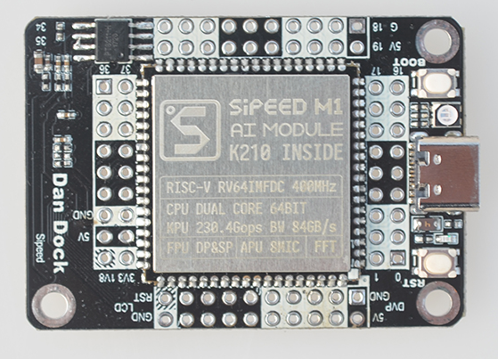

MaixPy Documentation
======

<div class="title_pic">
    
</div>

|   branch  |   build status  |
| --------- | --------------- |
|doc master |[](https://travis-ci.org/sipeed/MaixPy_DOC) |
|doc dev    |[](https://travis-ci.org/sipeed/MaixPy_DOC)    |
| code master | -- |

## What is MaixPy

MaixPy is a [Micropython](http://micropython.org/) port on 64Bit Dual-Core RISC-V CPU [K210](https://kendryte.com/),

> MicroPython is a lean and efficient implementation of the Python 3 programming language that includes a small subset of the Python standard library and is optimised to run on microcontrollers and in constrained environments.

> K210 created for AIOT(AI+IOT) use, It's powerful performance and low cost are very competitive.


Micropython make program on hardware(K210) easier, so we build this and open source on [github]((https://github.com/sipeed/MaixPy))

For example if we want to find I2C device, we just need code:
```python
from machine import I2C

i2c = I2C(I2C.I2C0, freq=100000, scl=28, sda=29)
devices = i2c.scan()
print(devices)
```


If we want to make a `breathing light` by PWM, we just need code:
```python
from machine import Timer,PWM
import time

tim = Timer(Timer.TIMER0, Timer.CHANNEL0, mode=Timer.MODE_PWM)
ch = PWM(tim, freq=500000, duty=50, pin=board_info.LED_G)
duty=0
dir = True
while True:
    if dir:
        duty += 10
    else:
        duty -= 10
    if duty>100:
        duty = 100
        dir = False
    elif duty<0:
        duty = 0
        dir = True
    time.sleep(0.05)
    ch.duty(duty)
```

## About this documentation

Everything related to Maixpy, mainly about
* How to get a hardware( board )
* How to get start with MaixPy even we are not so be expert in program for hardware.
* Learn Micropython basic knowledge
* Libriaries(API) reference

## Let's get started

To get started, we need one dev board, there's three kind of board as follow:

* Dan dock with Sipeed M1(Dan) module



* Sipeed Maix BiT


* Sipeed Go


To get these board, visit [Sipeed official website](https://sipeed.com/)

More hardware infomation [here](en/hardware/hardware.md)

Then we can write software, refer to [get started](en/get_started.md)


## Feedback

* [Doc feedback](https://github.com/sipeed/MaixPy_DOC/issues)
* [Code feedback](https://github.com/sipeed/MaixPy/issues)


## Source code

MaixPy source code [on github](https://github.com/sipeed/MaixPy)

Maintained by &copy;<a href="https://www.sipeed.com" style="color: #f14c42">Sipeed</a> Co.,Ltd. More contributor [here](https://github.com/sipeed/MaixPy/graphs/contributors)

