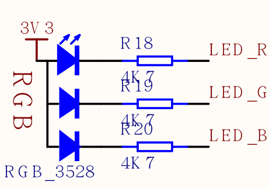

点亮LLED
==========


点灯程序作为学习所有开发板的第一个程序，就像 PC 语言的 hello world 一样，具有着神圣的意义


总所周知， 点亮一个 LED 需要一个电源， 一个电阻， 一个 LED 灯泡，
在 Dan Dock 开发板上， 有三个 LED， 线路如下：




比如我们希望红灯点亮， 即 `LED_R` 连接的这个 LED， 图中可以看到 LED 的正极已经连接了 3.3V 电源， 所以我们只要让 LED_R 为低电平 LED 即可点亮。

在写程序前，我们需要知道， MaixPy 所使用的硬件 K210 的片上外设（比如GPIO、I2C等）对应的引脚是可以任意设置的，STM32 片上外设和引脚对应关系已经固定了， 只有部分引脚可以复用， 相比之下 K210 自由度更大。
> 比如 I2C 可以使用 Pin11 和 Pin12, 也可以改成其它任意引脚

我们控制 LED 需要使用到 GPIO

程序如下：

```python

from Maix import GPIO

fm.registered(board_info.LED_R, fm.fpioa.GPIO0)

led_r=GPIO(GPIO.GPIO0,GPIO.OUT)
led_r.value(0)
```

其中， 我们先从包 `Maix` 导入了 `GPIO` 这个类；

前面说了　Ｋ210 的引脚可以任意设置，　所以我们使用`fm`(fpioa manager)这个内置的对象来注册芯片的外设和引脚的对应关系，　这里　`fm.fpioa.GPIO0` 是　Ｋ210 的一个 GPIO 外设（`注意区分 GPIO（外设） 和引脚（实实在在的硬件引脚）的区别` ）， 所以把 `fm.fpioa.GPIO0` 注册到了 引脚 `board_info.LED_R`；


然后定义一个 `GPIO` 对象， 具体参数看 `GPIO` 模块的文档， 在左边侧边栏查找。

使用 `value()` 函数来设置高低电平即可


